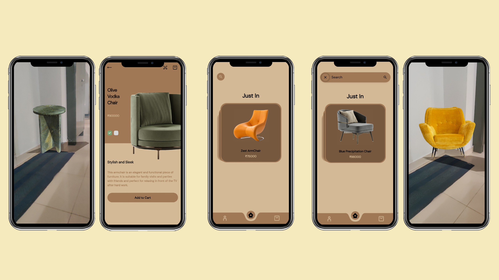

# Furn
- Furn is an Augmented Reality Furniture app that will be to create beautiful AR model of the given products.
- The UI of this application uses swipeable cards and other animations as shown in the full walkthrough below.

# Backend
- Furn is connected to a mongoDB Cluster using a custom build API.
- The APi is build on nest.js and mongoose.

# Screens

